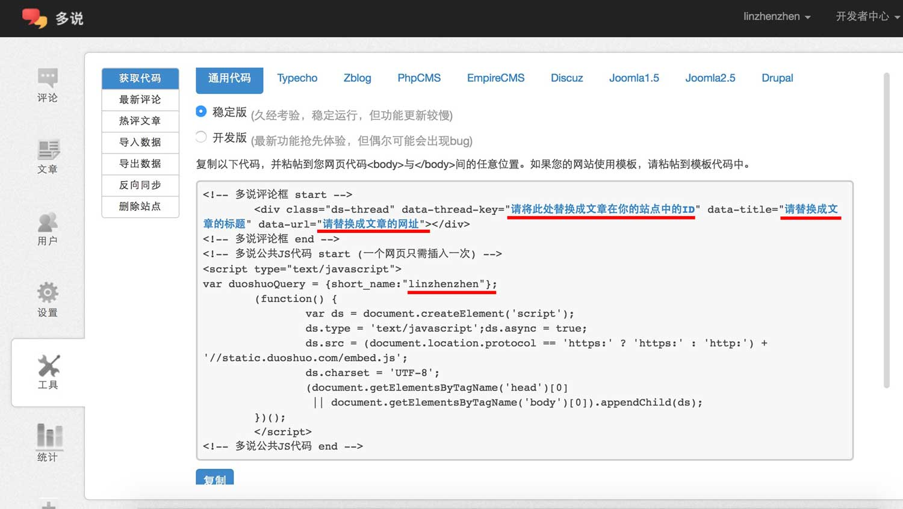
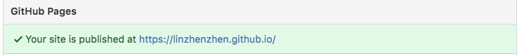

> 前言
今天是 2017-01-01, 元旦节, 节日快乐!

从2013-10月从事编程开始, 三年之后才开始写自己的个人博客, 不知道是不是太晚了, 不过blog也好, cnblogs, GitHub, 知乎, 豆瓣, 笔记, 自搭WordPress等也好, 每一个用来当程序员的技术展现都可行, 我写个人博客的原因, 是想到该好好把技术总结一下了, 有个归类, 而且以后那段时间不知道某个技术,可以直接打开自己的博客, 浏览一下某个文章, 为了方便记忆。

建立博客, 我是直接用了Hexo, 不过用[Hexo io](https://hexo.io/)之前, 还有[Jekyll](http://jekyll.com.cn/)也不错, 虽然是前端工程师, 但也从来都没有想要给自己设计一个网页, 哪怕是从HTML+CSS+JAVASCRIPT开始搭建, 而且逮到一个休息的时间, 就懒了, 就赖在老爸老妈家不起来了, 哈哈, 跑题了. 后来得知Hexo, 为博客而生, Home Page, About Page, Archives Page, Tag page, 404 都为大家默认生成了, 而且有相应的主题, 总有一款适合你, 可随时选择, 随时替换,因为是基于Markdown文本格式来写的内容, 只要内容存在, 随时会被鞭策到相应的主题当中, 另外支持git, 随时一句command就能推送到代码管理平台(我在这里用的是github, 另外还有coding等代码管理平台), 所以我用了一些时间来搭建了这个BLOG, 从选图到细节修改等, 中间当然遇到了不少问题, 下面是怎么搭建Hexo个人博客的步骤, 如果有什么问题, 请留言或者邮件, 会抽空帮助大家解决!

> 搭建前的环境支持(我用的是mac, window用户请见谅)

```
    Node.js - v6.2.0 (我当时的版本号, 可参考)
```

> 开始安装了
我用的编辑器是webStorm, 所以直接用自带的Terminal开始命令行的输入.

```
    npm install hexo-cli -g   // 全局安装hexo-cli, 为什么后面加个-cli, 我也不知道
    hexo init blog            // 初始化Blog文件夹, blog文件名可自取
    cd blog
    npm install               // 安装依赖
    npm generate              // 检测主题, 生成静态文件
    hexo server               // 用于启动服务器，主要用来本地预览, hexo为我们搭建了一个本地服务
```

在命令行此时会提示一段这样的代码

```
INFO  Start processing
INFO  Hexo is running at http://localhost:4000/. Press Ctrl+C to stop.
```

那么复制 [http://localhost:4000/](http://localhost:4000/), 并在浏览器打开这个地址, 就是刚刚初始化的Hexo blog, 默认的主题是 Landscape.

Hexo 的Theme主题是使用Bootstrap定制的网页样式, bootstrap已经是很成熟的了, 页面样式兼容各种浏览器及各种大小不一的移动给设备, 个人觉得不管在desktop, 还是iPad, phones 适配都是非常好的, UI体验也不错, 省去为页面排版兼容浪费时间.

> 安装完成, 看一下初始化的目录和文件
> 请注意, 在这里我放的是所有目录, 初始化之后, 只有scaffolds, source, themes, _config.yml, package.json

```
.deploy           // 执行hexo deploy命令部署到GitHub上的内容目录
node_modules      // npm install 生成装依赖的文件夹
public            // npm generate 生成的静态网页页面存储的地方, 为发布到线上环境的最终被编译的代码, 不需要在这里面更改网页内容
scaffolds         // 里面的三个draft.md, page.md, post.md是默认文件, layout模板文件目录, 一般都不去改这里面的配置
source            // 博客的内容资源, 其中_posts来保存*.md的文本
themes            // 主题, 把先换的主题直接拷贝到这个目录即可, 只需在_config.yml配置个信息, 在重新生成就更换好了.
_config.yml       // 全局选项配置
db.json           // 可不注意, 但最好不要删除
package.json      // npm init 之后生成, 应用程序数据, 为记录我们依赖的版本号
```

> 开始写文章了

我们写文章只需要用到, source/_posts/ 里面的 .md, 其他的都会在 npm generate 命令执行后, 自动编译在public静态资源中,
其中 `.md` 是我们的文章, 会被编译成`*.html`, 其他 `css,js,img` 会复制到public当中.

- source/about
- source/archives
- source/tags

上看三个文件夹各有一个index.md, 是默认生成的, 是我们之后的导航菜单, 里面不需要我们手动建立其他子页面, 就留着一个index就好.
切入正题, 写文章, 前提需要了解Markdown语法, 当然你可以试试html页面, 也是会编译的.

** 让我们来创建一个新的文章吧 **

```
hexo new layout new-article         // layout 为默认使用的布局, new-articles 为文件的名称
```

生成后的文件在 source/_posts/ 目录下, 名为 new-article.md

打开 new-article.md, 会看到以下一些配置:

```
layout: layout                     // 之后被编译使用的模版
title: new-article                 // 标题
date: 2017-01-03 16:22:28          // 当前时间, 可修改, 后作为目录结构, 如 2017/01/03/new-article
tags:                              // 给这个文章写个标签, 如果写了标签, 那么tags对应的目录会生成对应的tags页面, 那tags页面就有内容了.
                                   // tags 的写法是
                                   // tags:
                                   //     - css
                                   //     - web
---                                // 在这个之后 写正文的内容, 请使用markdown语法
```

除了这个文章文件, 还默认生成一个 new-article 的文件夹, 之后如果有图片信息, 可放置在这个文件夹中, 会随着编译, 放在文章同级的目录中

然后准备生成网页, 静态文件了, 请执行:

```
npm generate            // 或者 npm g
```

此时确保你的服务是开启的 `npm serve`, 然后刷新页面就能看到这篇文章

** well done ~ so easy ha. **

总之, 就写一篇文章, 就可以生成各个目录下的文章, 多玩几下就明白了.

> 管理代码放置 GitHub
> 我用github来管理代码, 在使用github, 你可以配置ssh为避免每次输入密码, 然后需要在 _config.yml 里面配置git地址和分支

```
deploy:
  type: git
  repo: https://github.com/linzhenzhen/linzhenzhen.github.io.git
  branch: master
```

repo 写你的git 地址
branch 写你的分支

然后执行

```
npm deploy        // 为我们生成 .deploy
```

另外github是公开的, 就意味着所有人能clone你的代码, 如果不希望被别人看到, 可使用其他代码管理器, 例如 [coding代码托管](https://coding.net/)

> 上面提到的命令可简写

```
hexo n    // hexo new
hexo g    // hexo generate
hexo s    // hexo server
hexo d    // hexo deploy 用于将本地文件发布到github上
hexo clean && generate   // && 为连接执行, 先执行clean, 在执行generate
```

> 多说评论框
> 当你的文章有幸被翻阅的话, 来访者想与你留言互动, 这时候需要一个简单快捷的评论框了, 这里大多数开发者都是用的 - duoshuo

1.创建 `多说` 账号, 请点击 [注册多说](http://duoshuo.com/create-site)

2.完成注册之后, 会形成如下图的代码块


3.复制全部代码块儿, 粘贴到你想要评论框出现的地方, 如: `/about` 或者某篇文章页脚等

4.注意上图画红线的部分, 希望你改成:

```html
<div class="ds-thread"
     data-thread-key="<%= page.path %>"
     data-title="<%= page.title %>"
     data-url="<%= page.permalink %>">
</div>
```

```js
<script type="text/javascript">
    // set duoshuo_username in _config.xml
    var _user = '<%= config['duoshuo_username'] %>';

    // set _user in duoshuoQuery
    var duoshuoQuery = {short_name: _user};

    // 此处省略其他代码
    ...
</script>
```

5.`page`的选项, 在你每次写文章的时候就会自动获取, 无需自己手动配置. 不过, `config['duoshuo_username']` 的配置, 需要你在 `_config.xml` 中配置你注册时候的`用户昵称`

```
# Duoshuo settings
duoshuo_username: linzhenzhen
```

6.就这么简单, 重新生成一下页面, 刷新看看, 简单的评论框就出现了.

> 使用 github 创建一个自己blog的有效域名

把用Hexo搭建出来的博客, 放在github代码托管器, 简单做个配置, 就可访问你的blog了, 比如说我的blog的访问地址是:

    linzhenzhen.github.io

以下几点为注意事项及设置步骤:

1.先在本地搭建好blog

2.上传至github中, 但需注意, 新建一个名称为 `*.github.io` 的仓库来放置你的blog代码, 所以之前你已经创建好了, 如果名称不对, 可以去 `Settings` 中修改一下,

3.上传代码到 `*.github.io` 的代码库中, 点击 `Settings`, 往下翻找到 `GitHub Pages` - `Source`, 默认只有master的话, 就已经设置好了 master 分支, 如果不想用master的话, 可以选择自己的分支.

4.在 `GitHub Pages` 下查看有条绿色的显示, 如下图:



5.点击这个链接就是你的blog名称了, 不需要付费, 代码在github就可以了.

6.注意点就是仓库的名称必须是你 github 账户的名称, 其实是遵守命名规则 `*.github.io` 才能自动生成有效域名

> HEXO 官网

[Hexo io](https://hexo.io/)

> 统计

[百度统计](http://tongji.baidu.com/web/welcome/login)
[Google统计](https://www.google.com/analytics/web/?hl=zh-CN)

> 其他问题

** 1 **

```
ERROR Deployer not found : github
```

修复方法

```
npm install hexo-deployer-git --save
```

** 2 **

```
{ [Error: Cannot find module './build/Release/DTraceProviderBindings'] code: 'MODULE_NOT_FOUND' }
{ [Error: Cannot find module './build/default/DTraceProviderBindings'] code: 'MODULE_NOT_FOUND' }
{ [Error: Cannot find module './build/Debug/DTraceProviderBindings'] code: 'MODULE_NOT_FOUND' }
```

修复方法

```
npm install hexo --no-optional
```

> 感言

终于有时间写博客了~ 此时是2017年, 新的一年, 又是新的开始, 非常感谢我现在周围的小伙伴们, 非常喜欢现在的工作环境. 此博客作为个人笔记专用.