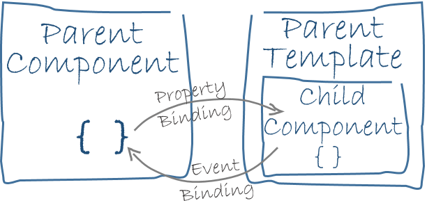

> 前言

之前也曾通读过 &lt;AngularJs权威教程&gt; 基于1.2.+的书, 并开发了一些项目, 刚入手不久, 就要转战 AngularJs 2.0 了, 前端真是更新太快, 不过, 还是庆幸了解一些AngularJs的变迁, 但是 1.0 与 2.0 不是说差别大的问题, 而是写法风格都变了, 但是相对而言, 2.0 对于组件封装, 面向对象, 依赖注入更明确一些, 更好入手一点.

这篇文章是学习了 Angular2 的基本架构做的总结, 为了自己方便日后重温. 页脚有练习官网实例的demo地址.

> Angular是什么

Angular 是一个用 HTML 和 JavaScript 或者一个可以编译成 JavaScript 的语言 (例如 Dart 或者 TypeScript ), 来构建客户端应用的框架.

用 Angular 扩展语言编写 HTML 模版, 用组件类管理这些模版, 用服务填写应用逻辑, 用模块打包发布组件与服务.

> 8个主要构造块

- 模块 (module)
- 组件 (component)
- 模板 (template)
- 元数据 (metadata)
- 数据绑定 (data binding)
- 指令 (directive)
- 服务 (service)
- 依赖注入 (dependency injection)

> module 模块

Angular 应用是模块化的, 有自己的模块系统, 称为 Angular 模块或者 `NgModule`.

每个 Angular 应用至少有一个模块 (根模块), - `AppModule`, 都带有 `@NgModule` 装饰器的类.

`NgModule` 是一个装饰器函数, 它接收一个用来描述模块属性的元数据, 重要属性是:

    declarations - 声明本模块中拥有的视图类. 组件\ 指令\ 管道
    exports - declarations 的子集, 可用于其他模块的组件模版
    imports - 本模块声明的组件模版需要的类所在的其他模块
    providers - 服务的创建者, 并加入早全局服务列表中, 可用于应用任何部分
    bootstrap - 指定应用的主视图 (根组件), 它是所有视图的苏住

简单的根模块:

```module
import { NgModule }      from '@angular/core';
import { BrowserModule } from '@angular/platform-browser';
@NgModule({
  imports:      [ BrowserModule ],
  providers:    [ Logger ],
  declarations: [ AppComponent ],
  exports:      [ AppComponent ],
  bootstrap:    [ AppComponent ]
})
export class AppModule { }
```

    注意: `AppComponent` 的 `export` 并不是必须的, 根模块不需要导出任何数据, 因为其它组件不需要导入根模块.

我们通过引导根模块来启动应用. 通常在一个 `main.ts` 文件中引导 `AppModule`:

```ts
import { platformBrowserDynamic } from '@angular/platform-browser-dynamic';
import { AppModule } from './app.module';

platformBrowserDynamic().bootstrapModule(AppModule);
```

Angular 模块库都带有 `@angular` 的前缀.  用 `npm` 包管理工具安装它们, 用 JavaScript 的 `import` 语句导入其中某些部件. 例如:

```
import { Component } from '@angular/core';
```

```
import { BrowserModule } from '@angular/platform-browser';   // 使用 JavaScript 的导入语句从 Angular 库中导入Angular模块
```

在上面语句中, 需要用到 `BrowserModule` 的某些素材, 需要把它加入 `@NgModule` 元数据 `imports` 中, 如下:

```
imports:      [ BrowserModule ],
```

这种情况下, 同时使用了 Angular 和 Javascript 的模块化系统. 它们引入了共同的词汇 `imports` 和 `exports`, 需要不断实践慢慢就会分清.

> component 组件

组件负责控制屏幕上的一小块区域, 称之为视图.

在类中定义组件的应用逻辑, 为视图提供支持. 组件通过一些由属性和方法组成的API与视图交互.

```
export class HeroListComponent implements OnInit {
  heroes: Hero[];                                     // 数组属性
  selectedHero: Hero;                                 // 已选择的单个数据

  constructor(private service: HeroService) { }

  ngOnInit() {
    this.heroes = this.service.getHeroes();           // 获取数组中的数据
  }

  selectHero(hero: Hero) { this.selectedHero = hero; }  // 选择一个数据时, 记录单个数据
}
```

> template 模板

用组件自带的模板定义视图, 还是已 `HTML` 的形式书写.

```
<h2>Hero List</h2>

<p><i>Pick a hero from the list</i></p>

<ul>
  <li *ngFor="let hero of heroes" (click)="selectHero(hero)">
    {{hero.name}}
  </li>
</ul>

<hero-detail *ngIf="selectedHero" [hero]="selectedHero"></hero-detail>
```

上述代码中, 比较陌生的写法, 或者新的语法都是 Angular 的模板语法. 其中 `hero-detail` 标签是一个新组件自定义元素, 与原生 HTML 布局相融合. 如下图显示:


> metadata 元数据

元数据是告诉 Angular 如何处理一个类.

其实 *.component 其实就是一个类. 如果把 `Component` 变成组件, 只需要把元数据附加到这个类. 如下代码片段:

```
@Component({                                        // @Component 装饰器, 在 TypeScript中, 用 decorator 来附加元数据
  moduleId: module.id,
  selector: 'hero-list',
  templateUrl: 'hero-list.component.html',
  providers: [ HeroService ]
})
export class HeroListComponent implements OnInit {
/* . . . */
}
```

`@Component` 接收一个配置对象, Angular会基于这些信息创建和展示组件及视图.
`@Component` 的配置项包括:

    moduleId - 为与模块相关的 URL (如 templateUrl) 提供基地址
    selector - css选择器, 在父级 HTML 中插入 <my-app> 标签
    templateUrl - HTML模板相对地址
    styleUrls - 页面所需样式, 多则用数组引用 ['1.css', '2.css', '3.css']
    providers - 组件所需服务的依赖注入提供商数组. 提供需要一个 Service.

其他一些元数据装饰器. 例如: `@Injectable`, `@Input`, `@Output` 等

> data-binding 数据绑定

Angular 的数据绑定, 是一种让模板的各部分与组件的各部分相互结合的机制.

如下图, 数据绑定的语法有四种形式, 每种形式都有一个方向 - 绑定到DOM, 绑定自DOM, 双向绑定.


代码示例:
```
<li>{{hero.name}}</li>                              // 插值表达式
<hero-detail [hero]="selectedHero"></hero-detail>   // 属性绑定
<li (click)="selectHero(hero)"></li>                // 事件绑定
<input [(ngModel)]="hero.name">                     // 双向数据绑定
```

事件循环所有数据绑定从树的根部, 递归处理全部子组件. 下图为模板与组件间的绑定关系,  父与子组件间的通讯方式





> directive 指令
> 还有两种其它类型的指令：结构型指令和属性 (attribute) 型指令

指令是一个带有 "指令元数据" 的类. 在 TypeScript 中, 要通过 @Directive 装饰器 把元数据附加到类上.

    组件是一个带模板的指令；@Component装饰器实际上就是一个@Directive装饰器，只是扩展了一些面向模板的特性.
    虽然严格来说组件就是一个指令，但是组件非常独特，并在 Angular 中位于中心地位，Angular单独把组件从指令中独立了出来

结构型指令通过在DOM中添加, 移除和替换元素来修改布局. 例如:

```
<li *ngFor="let hero of heroes"></li>               // *ngFor
<hero-detail *ngIf="selectedHero"></hero-detail>    // *ngIf
```

属性型指令修改一个现有元素的外观或行为. 例如:

```
<input [(ngModel)]="hero.name">  // ngModel修改现有元素, input行为: 设置显示属性, 并响应change事件
```

Angular 还有少量指令, 它们或者修改结构布局`ngSwitch`, 或者修改DOM元素和组件 `ngStyle`, `ngClass`


> service 服务

几乎任何都可以说是一个服务. 典型的服务是一个类, 具有专注的, 明确的用途, 做一个特定的事件, 并做好. 例如:

- 日志服务
- 数据服务
- 消息总线
- 税款计算器
- 应用程序配置

服务没是那么特别属于 Angular 的特性, Angular 对于服务也没有什么定义. 但是, 服务仍然是任何 Angular 应用的基础, 组件就是最个的服务消费者.

服务类示例, 吧日志记录在浏览器的控制台:

```
export class Logger {
  log(msg: any)   { console.log(msg); }
  error(msg: any) { console.error(msg); }
  warn(msg: any)  { console.warn(msg); }
}
```

有了服务, 可以把获取数据, 验证输入, 控制台日志等琐事委托给服务. `组件类应保持精简, 只为设计及提供数据的属性和方法.`


> dependency injection 依赖注入

依赖注入是提供类的新实例的一种方式, 负责处理好类所需的全部依赖. 大多数依赖都是服务. Angular 使用依赖注入来提供组件以及组件所需的服务. 例如:

```
constructor(private service: HeroService) { }  // 通过构造函数的参数类型得知组件需要那些服务
```

用一张图来表示依赖注入在组件中的服务引入


在用注入服务之前, 需要在注入器中注册提供商 `Provider`.

```
providers: [             // 添加在根模块上, 在任何地方使用服务的同一个实例
  BackendService,
  HeroService,
  Logger
],
```

```
@Component({             // 在 @Component 元数据中的 providers 属性中注册在组件层
  moduleId: module.id,
  selector:    'hero-list',
  templateUrl: 'hero-list.component.html',
  providers:  [ HeroService ]
})
```

需要记住的关于依赖注入的要点是：

- 依赖注入渗透在整个 Angular 框架中，被到处使用。
- 注入器 (injector) 是本机制的核心。
- 注入器负责维护一个容器，用于存放它创建过的服务实例。
- 注入器能使用提供商创建一个新的服务实例。
- 提供商是一个用于创建服务的配方。
- 把提供商注册到注入器。


> Take exercises

了解以上Angular架构组成之后, 看懂一个简单组件初始化 `Hello Angular` 就容易的多了.

初始一个简单的 Hello Angular [点击查看官网 - 快速体验Angular](http://origin.angular.live/docs/ts/latest/quickstart.html)
官网练习英雄列表Demo, 包括主导航, 最新Top, 列表, 查看详情以及返回等功能. [点击查看最终代码](https://github.com/linzhenzhen/angular-js-2-demo)


> 其次

了解这些之后, Angular2.0 还有一些重要特性和服务需要学习, 如: 动画, 变更检测, 事件, 表单, HTTP, 生命周期钩子, 管道, 路由器, 测试等.

> 小扩展

TypeScript 是 ES6 JavaScript 类型化的超集。ES6 JavaScript 是 ES5 JavaScript 的超集。ES5 是可以在所有现代浏览器中运行的 JavaScript

降级的过程是

    TypeScript 降级到 带装饰器的 ES6
    带装饰器的 ES6 降级到 没有装饰器的 ES6 (“普通 ES6”)
    没有装饰器的 ES6 降级到 ES5