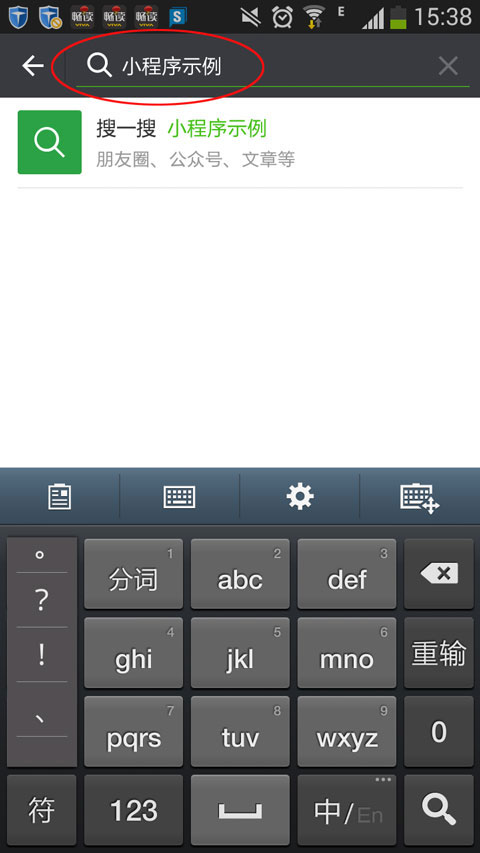
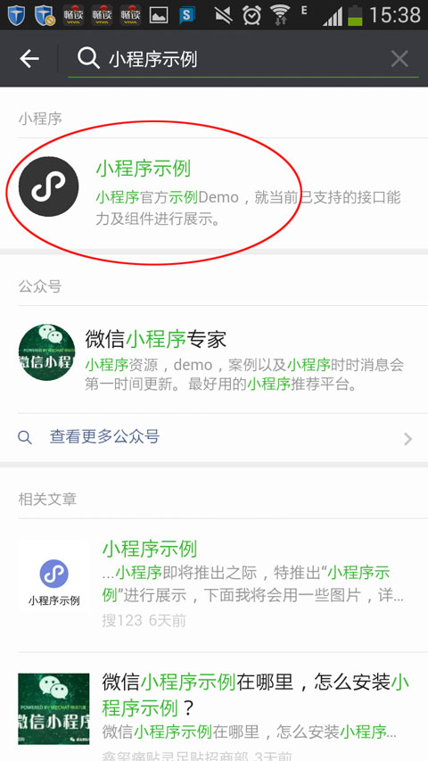
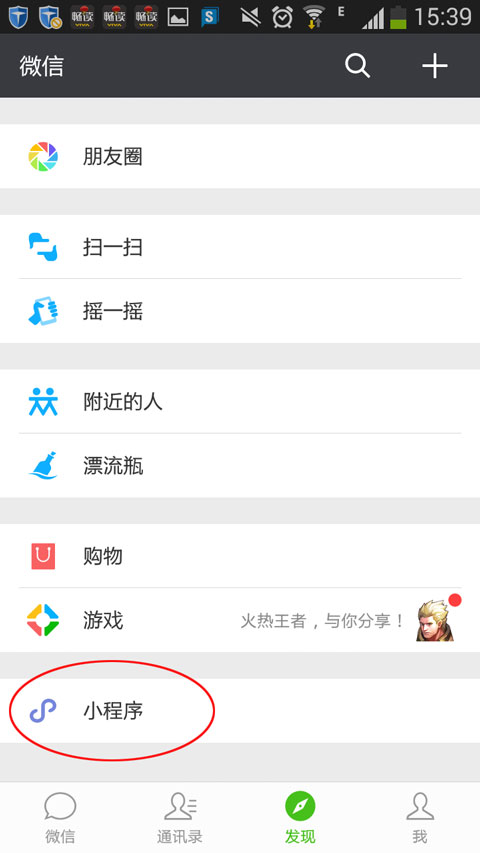

> 前言

张小龙在2017微信公开课Pro上发布的小程序于2017年1月9日正式上线. 他是这么阐述小程序的.

小程序是一种不需要下载、安装即可使用的应用，它出现了触手可及的梦想，用户扫一扫或者搜一下即开打开应用，也出现了用完即走的理念，用户不用关心安装太多应用的问题，应用随处可用，但又无须安装卸载。


> 小程序的特点

1：无需下载：我们直接使用它，所以无须安装是小程序最基础的一个特性；
2：触手可及：当我们拿着智能手机接触周边的时候，我们可以通过手机直接获得信息，就是周边的信息；
3：用完即走：对于周边要完成的任务来说我们需要的是用完即走；
4：无须卸载：小程序看起来是程序，但是它以完全不同于过去APP的形状出现，它有更灵活的应用组织形态；


> 先体验一下吧, 作为用户

1.首先, 需要检查微信版本, 需要升级至 6.5.3+

2.如果没有找到小程序的入口的话, 需要按照以下步骤, 去让小程序出现. 在微信打开搜索拦, 输入"小程序示例", 如下图:


3.选择下面LOGO是黑色斜写的英文字母"S", 点击它, 可以随便预览一下, 也可以后退, 或者关闭


4.在微信下面的导航中, 点击"发现", 如下图, 小程序的入口就出现.


5.可以说放出来来了小程序入口, 不如说是一个历史浏览记录, 之后你搜索的记录, 都会在这个入口点击后的列表会看到, 请看我的浏览历史.


6.除了以上为搜索方法外, 其他朋友在聊天内分享的二维码, 扫一扫也是可以的, 简单的说, 初始化一次, 就可在发现内点击小程序查看其他平台的小程序了.

7.提醒: 搜索到我记录的时间来看, 不支持模糊查找, 需要几乎确切的名称才可以查到.


> 咱也玩玩小程序吧, 作为开发者

1.需要先注册, 申请Appid, 在这里我就不详细描述了, 直接看官网教程吧, 我这里用的公司申请的, 所以是参与的开发者.

[点击查看 - 微信小程序接入指南](https://mp.weixin.qq.com/debug/wxadoc/introduction/index.html?t=2017112)

2.申请好了, 下载开发者工具, 我选择的是 `mac`

[点击下载 - 开发者工具](https://mp.weixin.qq.com/debug/wxadoc/dev/devtools/download.html?t=2017112)

3.启动开发者工具, 会出现下面这个界面, 用你的手机微信, 扫码进入就行


4.创建项目, 点击 `添加项目`, 注意: 如果之后需要发布小程序的话, 需要填写AppID, 如果只是学习, 可以忽略. 但是在选择项目目录时候请选择一个空目录, 对于初学者来说, 为由`quickstart`生成几个默认文件, 供初学者认识界面搭建


5.创建完, 之后会显示下面一个初始化界面.


6.如果想先做了解小程序的各种组件实现效果的话, 可在前文提到的搜索 `小程序示例`, 也可以扫下面链接打开的`微信小程序官方示例`, 并可下载源代码.

[点击查看 - 小程序示例](https://mp.weixin.qq.com/debug/wxadoc/dev/demo.html?t=2017112)


> 开发之前 - 初认识

1.小程序目录结构:

```
- pages                      // 作为之后页面的显示, 可自动生成, 请往下看
  -- index
     -- index.js
     -- index.json
     -- index.wxml
     -- index.wxss
  -- logs
     -- logs.js
     -- logs.json
     -- logs.wxml
     -- logs.wxss
- utils                      //
  -- util.js
- app.js                     // 根目录全局默认配置, 可修改: 小程序逻辑
- app.json                   // 根目录全局默认配置, 可修改: 小程序公共设置 如界面样式, 顶部或底部导航, 下拉刷新背景等
- app.wxss                   // 根目录全局默认配置, 可修改: 小程序公共样式表
```

注意: 以上根目录的 `app.js`, `app.json`, `app.wxss` 为全局配置, 如果pages里的 js,json,wxss写了同样的内容, 会直接用pages的定义.

2.小程序文件规则:

| 文件类型    | 是否必填   |  作用    |
|:----------:|:---------:|:-------:|
| js         | true      | 页面逻辑 |
| wxml       | true      | 页面结构  |
| wxss       | false     | 页面样式表 |
| json       | false     | 页面配置 |

注意：为了方便开发者减少配置项，微信小程序规定描述页面的这四个文件必须具有相同的路径与文件名.

> app.json 配置
> 对微信小程序进行全局配置，决定页面文件的路径、窗口表现、设置网络超时时间、设置多 tab 等

```
{
  "pages": [                             // [String Array] 设置页面路径
    "pages/index/index",
    "pages/logs/logs",
    "pages/demo/demo"                    // Tip: 如果想生成新的页面, 无需右键逐一新建, 只需要在这里多加一行目录名称, save即可自动生成带有`js`, `json`, `wxml`, `wxss` 的文件, 删除则需要手动删除文件以及pages的配置
  ],
  "window": {                            // [Object] 设置默认页面的窗口表现
    "navigationBarTitleText": "Demo"
  },
  "tabBar": {                            // [Object] 设置底部 tab 的表现
    "list": [{
      "pagePath": "pages/index/index",   // Tip: 只有配置了 tabBar 的页面 才会出现tabBar, 否则其他页面底部导航
      "text": "首页"
    }, {
      "pagePath": "pages/logs/logs",
      "text": "日志"
    }]
  },
  "networkTimeout": {                    // [Object] 设置网络超时时间
    "request": 10000,
    "downloadFile": 10000
  },
  "debug": true                          // [Boolean] 设置是否开启 debug 模式
}
```

请在读一遍 `Tip`, 有好处. 更多信息可 [点击查看 - 微信小程序框架配置](https://mp.weixin.qq.com/debug/wxadoc/dev/framework/config.html?t=2017112)

> 微信小程序提供了各种API
> 如我们平常开发, 都需要链接接口数据, 然后渲染到页面上, 可以用 `wx.request` 发起HTTPS请求.

更多对外接口, [点击查看 - 微信小程序API](https://mp.weixin.qq.com/debug/wxadoc/dev/api/network-request.html)


> 微信小程序还提供了各种语义化组件, 和各种应用DEMO
> 如: swiper轮播图, scroll-view横向纵向区域滚动, icon图标等

[点击查看 - 微信小程序组件](https://mp.weixin.qq.com/debug/wxadoc/dev/component/?t=2017112)


> 微信小程序调试

为了帮助开发者简单和高效地开发微信小程序, 全新的开发者工具 ，集成了开发调试、代码编辑及程序发布等功能

看开发者工具, 从左到右有四个主要的部分

- 开发者导航: 编辑, 调试, 项目, 编译, 后台, 缓存等
- 开发者预览界面
- 项目目录
- 文件开发界面

点击左侧 `调试`, 可看到右侧变成了模拟浏览器的`开发者工具`类似的界面, 其中有:

- Wxml panel
- Sources panel
- Network panel
- Appdata panel
- Storage panel
- Console panel

作为前端开发者, 这些开发者工具应该不会很陌生, 更多信息 [点击查看 - 微信小程序程序调试](https://mp.weixin.qq.com/debug/wxadoc/dev/devtools/devtools.html?t=2017112)


> 最后几点内容, 可参考

1.设计时可参考一下微信小程序对设计小程序的理念风格 [点击查看 - 微信小程序设计指南](https://mp.weixin.qq.com/debug/wxadoc/design/index.html?t=2017112)

2.上线发布小程序 [点击查看 - 代码审核与发布](https://mp.weixin.qq.com/debug/wxadoc/introduction/?t=201718#代码审核与发布)

3.开发中的问题 [点击查看 - Q&A](https://mp.weixin.qq.com/debug/wxadoc/dev/qa.html?t=2017112)

4.开发者工具快捷键

4.1.格式调整

    Ctrl+S：保存文件（必须保存才可以看到效果）
    Ctrl+[， Ctrl+]：代码行缩进
    Ctrl+Shift+[， Ctrl+Shift+]：折叠打开代码块
    Ctrl+C Ctrl+V：复制粘贴，如果没有选中任何文字则复制粘贴一行
    Shift+Alt+F：代码格式化
    Alt+Up，Alt+Down：上下移动一行
    Shift+Alt+Up，Shift+Alt+Down：向上向下复制一行
    Ctrl+Shift+Enter：在当前行上方插入一行
    Ctrl+Shift+F：全局搜索

4.2.光标相关

    Ctrl+End：移动到文件结尾
    Ctrl+Home：移动到文件开头
    Ctrl+i：选中当前行
    Shift+End：选择从光标到行尾
    Shift+Home：选择从行首到光标处
    Ctrl+Shift+L：选中所有匹配
    Ctrl+D：选中匹配
    Ctrl+U：光标回退

4.3.界面相关

    Ctrl + ：隐藏侧边栏
    Ctrl + m: 打开或者隐藏模拟器

5.在学习中查阅的其他资料, 做个记录

[从零开始：微信小程序新手入门宝典《一》](https://segmentfault.com/a/1190000008035180)
[如何为你的微信小程序瘦身？](http://www.jianshu.com/p/c9ed7c7fcc27)