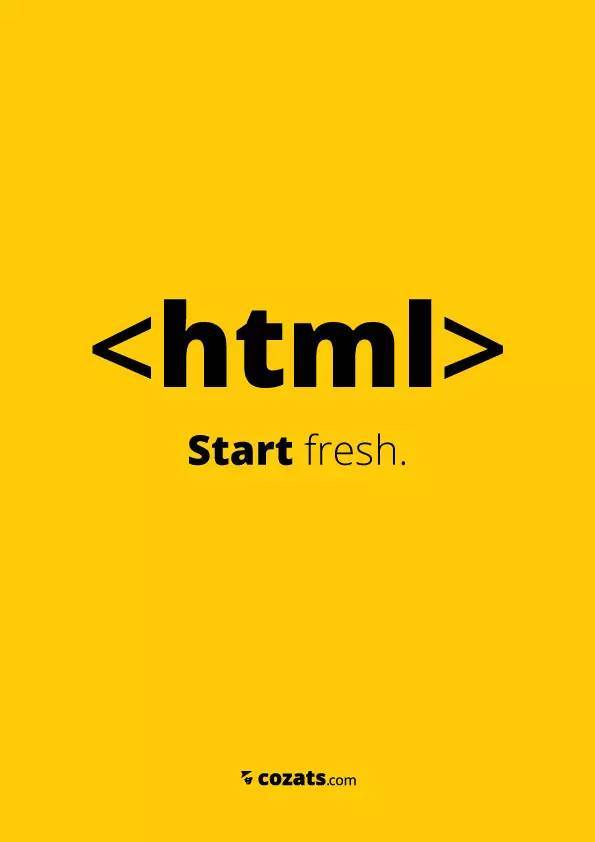
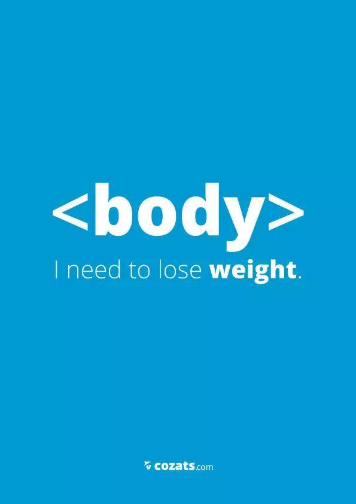
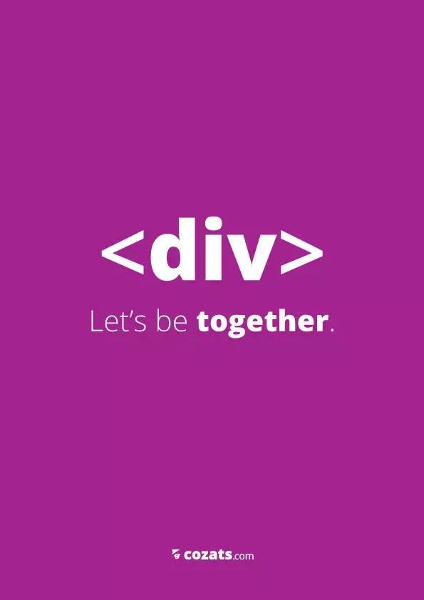
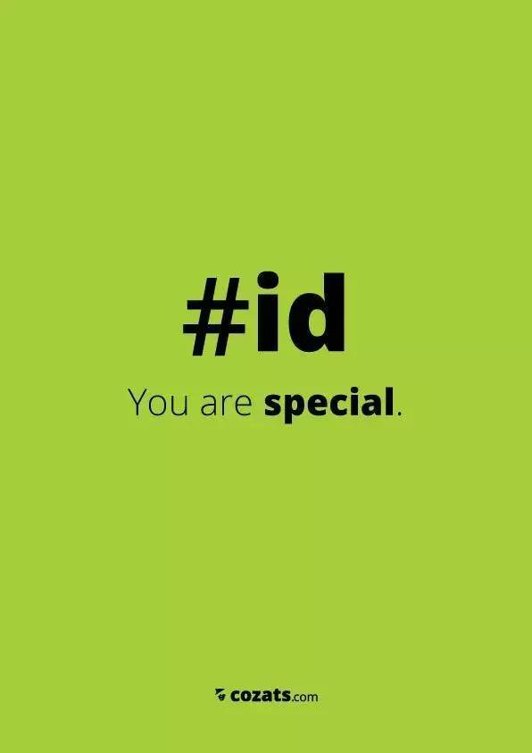
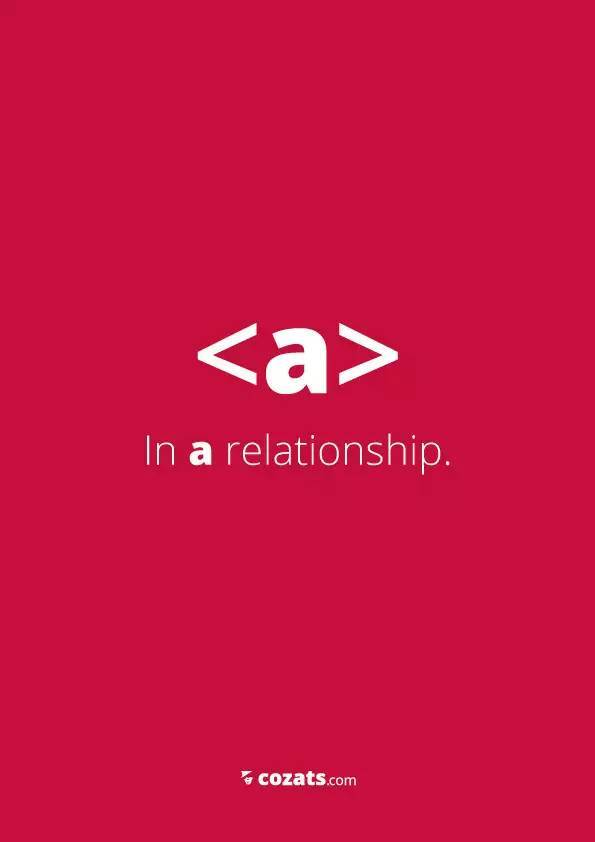
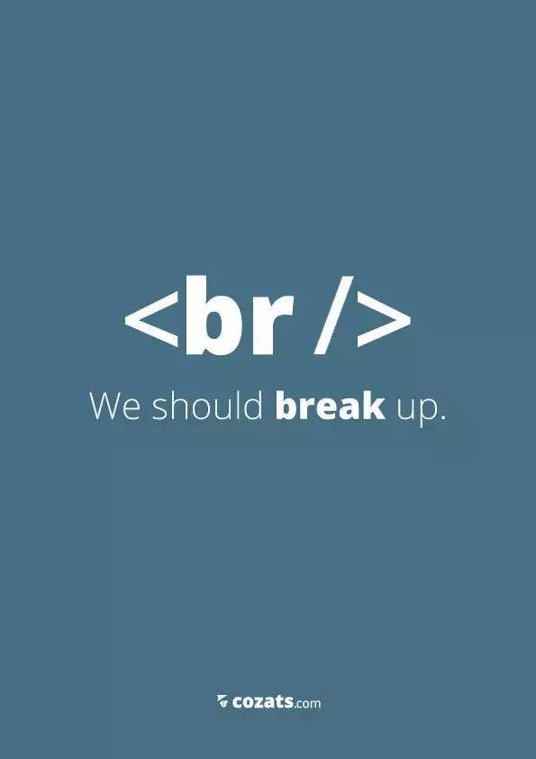
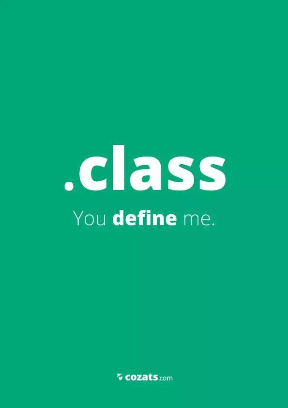
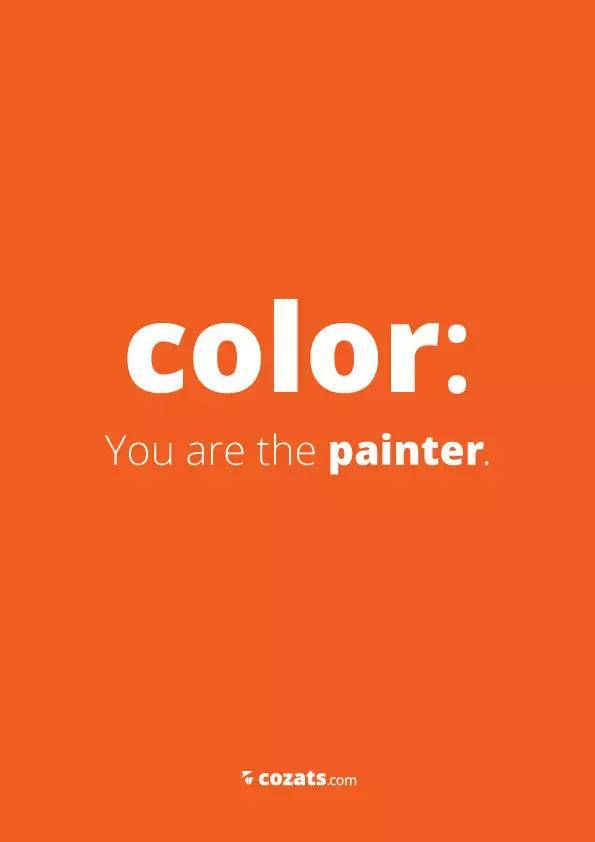
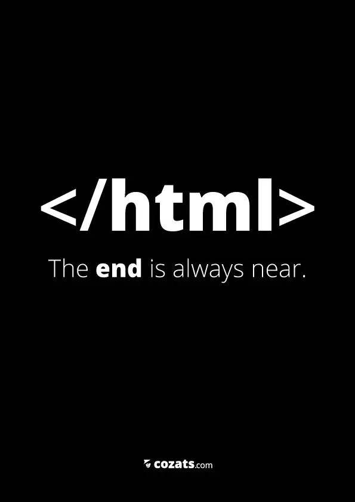

layout: post
title: "Happy New Year - 2017"
subtitle: "<&frasl;2016><2017> 来自前端的特别祝福"
date: 2017-01-03 20:15:51
author: "mslinzz"
tags:
    - 前端生活
    - awesome
---

> 前言

在微信订阅号 `前端大全` 看到有意思的一组图片, 语义话的HTML标签, 分别送给大家新年的祝福, 所以搬到这里来了! (转自前端大全, 下面是微信公众号)

> <&frasl;2016><2017>
> <strong>前端大全祝大家新年快乐！</strong>

这种前端特有的表达方式让主页君想起了希腊设计师 Costas 的前端主题创意海报，也是用前端标签表达特别的用意。跨年之际，用 Costas 的这组前端创意海报作为新年祝福送给持续关注和支持前端大全的朋友们。

Costas是一位希腊设计师，住在雅典。目前就职于智威汤逊（雅典），也会做一些自由职业者的工作。他擅长桌面出版和Logo设计，也做过网页设计和用户界面设计。以下是他制作的一组前端代码主题创意海报。

欢迎大家补充更多有意思的 HTML 标签解读。
